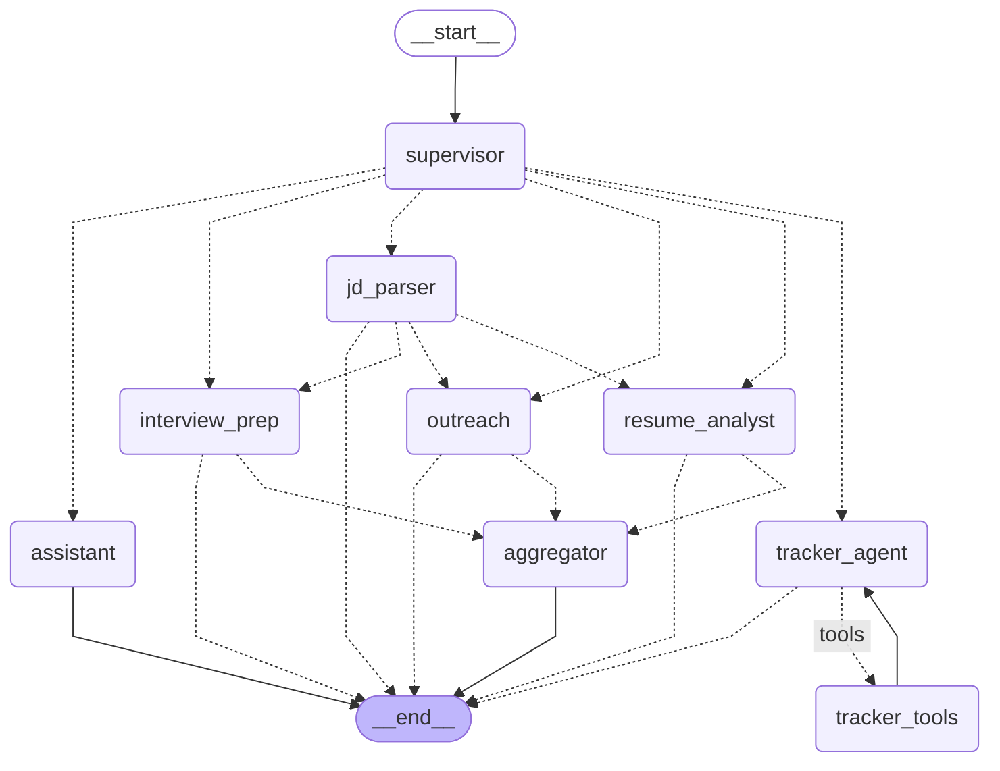

# 🎯 AI Job Application Command Centre

**A multi-agent system that runs a student's entire job hunt from one chat box** — it tracks every application, parses job descriptions from any source, scores your resume against them, drafts recruiter outreach, and prepares interview notes. Six specialised agents, orchestrated with LangGraph, coordinate through **supervisor routing** and a **parallel fan-out + aggregator** flow.

> Built solo for the Agentic AI LS'26 Week-4 capstone. Runs entirely on free tiers: Groq for LLMs, local ONNX MiniLM for embeddings.


---

## 1. The problem

Students and recent graduates apply to *dozens* of roles across portals, LinkedIn posts, recruiter emails, and referrals. The mess is real:

- Postings live in incompatible formats — a careers page, an emoji-laden LinkedIn post, a "reply by Friday!" email.
- Every serious application needs the same expensive ritual: extract what they want, check your resume against it, write a non-cringe message to a recruiter, prep for the interview.
- Tracking happens in a dying spreadsheet, so deadlines get missed and follow-ups never happen.

**Why this genuinely needs *multiple* agents rather than one prompt:** parsing a messy posting into a strict schema, auditing a resume against evidence, writing outreach in a human voice, generating interview prep, and doing CRUD on a database are five different jobs with different output contracts (validated JSON vs. grounded analysis vs. free prose vs. tool calls), different temperature/model needs, and different failure modes. And when you say *"get me fully ready for this role"*, three of them don't depend on each other — so they shouldn't run one after another. That's an orchestration problem, not a prompting problem.

## 2. What it does

| You say | What happens |
|---|---|
| *paste JD* + "track this" | **JD Parser** extracts a structured `JobPosting` (skills, ATS keywords, deadline…), upserts SQLite, indexes it in Chroma |
| "prepare the **full application kit**" | JD Parser first (if a JD was pasted), then **Resume Analyst ∥ Outreach ∥ Interview Prep run in parallel**, and the Aggregator composes one downloadable kit |
| "how well does my resume fit …?" | **Resume Analyst**: deterministic ATS keyword coverage + RAG-grounded gap analysis + concrete bullet rewrites |
| "draft a referral message for …" | **Outreach**: LinkedIn DM, referral ask, cold email, follow-up — personalised from your actual resume |
| "what should I prepare for the … interview?" | **Interview Prep**: technical + behavioral questions, STAR prompts mapped to *your* projects |
| "I cleared the OA!" / "what's due this week?" | **Tracker** agent updates/queries the database through tools |

## 3. Architecture

### 3.1 Orchestration patterns (the point of this project)

Of the four taught patterns — Supervisor, Pipeline, Parallel + Aggregator, Hierarchical — this system deliberately combines **two, plus a tool loop**:

1. **Supervisor** — every turn starts at a lightweight router agent (8B model, structured output) that classifies the message and dispatches exactly one specialist. Specialists never call each other; control always returns through graph edges. Job references like "the arcadia role" are resolved to database rows *deterministically in Python* — no tokens spent on lookups.
2. **Parallel + Aggregator** — the flagship "application kit" flow. The router's conditional edge returns a **list** of three node names, so LangGraph runs Resume Analyst, Outreach, and Interview Prep **concurrently in one superstep**, then joins them in an **LLM-free aggregator** that composes the kit, writes it to disk, and records artifacts.
   *Why not the Send API?* `Send` exists for *dynamic* fan-out — N tasks decided at runtime with private per-task state. Our branch set is static (always these three specialists), and a conditional edge returning a list is the documented mechanism for exactly that. Knowing which tool **not** to use is part of orchestration design.
3. **Tool-calling (ReAct) loop** — the Tracker agent binds five CRUD tools and loops `agent → tools → agent` until it has done everything the user asked ("mark arcadia applied **and** show my stats" chains two calls).


Join-correctness detail: each parallel branch writes **its own distinct state key** (`resume_report` / `outreach_drafts` / `interview_notes`) so the concurrent superstep never double-writes a channel, and all three branches are single-shot nodes, so they finish in the same superstep and the aggregator is scheduled exactly once with merged state.

### 3.2 The graph (generated from the real compiled graph)

This diagram is not hand-drawn — it is the output of `python -m src.graph` (`graph.get_graph().draw_mermaid()`), so it is guaranteed to match the code:



### 3.3 The agents

| Agent | Responsibility | Model | Output contract |
|---|---|---|---|
| **Supervisor** | classify message → route; resolve job hints against SQLite; reset per-turn state | `llama-3.1-8b-instant` | `RouteDecision` (Pydantic) |
| **JD Parser** | messy posting text (portal / LinkedIn / email) → structured posting; upsert DB; index Chroma | `llama-3.3-70b-versatile`, temp 0 | `JobPosting` (Pydantic) |
| **Resume Analyst** | deterministic ATS keyword coverage + RAG-grounded gaps and bullet rewrites | 70B, temp 0 | `ResumeFitReport` (Pydantic) |
| **Outreach** | LinkedIn DM, referral request, cold email, follow-up — grounded in resume excerpts | 70B, temp 0.4 | markdown |
| **Interview Prep** | technical/behavioral questions, STAR prompts mapped to real resume bullets | 70B, temp 0.3 | markdown |
| **Tracker** | conversational CRUD via 5 tools (`add/update/get/list/stats`) in a ReAct loop | 70B, temp 0 | tool calls → table summaries |
| **Aggregator** | compose kit file, record artifacts, emit the final message | *no LLM* | file + DB rows |
| **Assistant** | help, chit-chat, and graceful disambiguation when no job matches | 8B | text |

The Streamlit board and the agents are **two clients of the same SQLite database** — you can edit a status by hand on the board or by telling the tracker agent; both write the same rows and the KPIs update either way.

## 4. RAG design

- **Embeddings:** chromadb's built-in ONNX **all-MiniLM-L6-v2** — local, free, ~80 MB once. Chosen over `sentence-transformers` (drags in ~2 GB of torch) and API embeddings (Groq doesn't offer any). Considered FastEmbed; the built-in default needs zero extra dependencies.
- **`resume` collection:** the resume is split on `##` section headers, then recursively into ≤500-char chunks tagged `[Section]` — so "tell me about a project with SQL" retrieves the right bullets, not the whole document.
- **`jobs` collection:** each parsed JD is stored as a ~150-word condensed doc keyed by application id — future queries stay small and cross-application semantic search becomes possible.
- **Grounding rule:** Outreach and Interview Prep only ever see *retrieved resume excerpts*, and their prompts forbid inventing experience — retrieval is the hallucination guard, not just a token saver.
- The deterministic ATS scorer reads the **full raw resume text** on purpose: keyword coverage should never depend on which chunks retrieval happened to return.

## 5. Engineering decisions & trade-offs

- **Free-tier rate-limit budgeting.** Groq limits are *per model*, so routing lives on the 8B model and specialist work on the 70B — the router never queues behind a kit. Each model family gets a client-side `InMemoryRateLimiter` plus `max_retries=3`; a full kit costs only ~5 LLM calls because…
- **Specialists are single-shot nodes, not mini-agents.** Retrieval and DB reads happen as plain Python *inside* each node. One LLM call per specialist keeps kits fast, cheap, and — critically — guarantees all three parallel branches complete in the same superstep, making the aggregator join trivially correct.
- **The aggregator is deliberately LLM-free.** The specialists already produced final markdown; composing them is deterministic string work. Zero tokens, zero latency, one less failure mode.
- **Deterministic core inside an LLM system.** ATS keyword coverage is computed in Python with word-boundary matching (so `sql` doesn't match `mysql`) and handed to the Resume Analyst as ground truth it must stay consistent with — the fit score is reproducible, not vibes.
- **Structured-output fallback chain.** Every schema call goes through `structured_call()`: native tool-calling → JSON-mode retry with the schema in-prompt → regex-extract + Pydantic validation.
- **Tool-call repair layer.** Groq-hosted llama occasionally emits a tool call as *literal text* (`<function(update_application){...}`). The tracker node detects this, deterministically parses it into a real tool call when possible, and only then falls back to a corrective retry — observed and fixed during development, not hypothetical.
- **Streamlit × LangGraph memory.** The compiled graph (and its `InMemorySaver` checkpointer) is cached with `@st.cache_resource` so conversation memory survives Streamlit's script reruns; each browser session gets its own `thread_id`. The supervisor resets all per-turn state keys every turn so a previous kit never leaks into the next request.
- **History trimming, Groq-safe.** Only the last ~8–10 messages are sent, and the trimmer never slices between a tool-calling message and its tool results (Groq rejects orphaned tool messages).

## 6. Setup

Prereqs: **Python 3.10+**, a free **Groq API key** ([console.groq.com/keys](https://console.groq.com/keys)).

```bash
git clone <this-repo> && cd <repo>
python -m venv .venv
# Windows:            .venv\Scripts\activate
# macOS/Linux:        source .venv/bin/activate
pip install -r requirements.txt

# add your key
cp .env.example .env          # Windows: copy .env.example .env
#   then edit .env -> GROQ_API_KEY=gsk_...

# one-command demo bootstrap (seeds 4 demo applications, indexes the resume;
# first run downloads the ~80 MB local embedding model — one time only)
python -m src.setup_demo

streamlit run app.py
```

**Use your own resume:** replace the contents of `data/sample_resume.md` (keep `##` section headers), then click *Rebuild resume index* in the sidebar.

Model overrides (e.g. if a model is deprecated): set `GROQ_MODEL_MAIN` / `GROQ_MODEL_FAST` in `.env`.

## 7. Two-minute demo script

1. Launch — the board already shows 4 seeded applications and live KPIs.
2. Open `data/sample_jds/arcadia_ml_newgrad.txt` (a messy LinkedIn-style post 🚀), paste it into the chat with:
   **"track this and prepare the full application kit"**
   → watch the live agent stream: Supervisor → JD Parser → *three specialists in parallel* → Aggregator → a complete kit renders in chat.
3. **"Mark Arcadia as applied today"** → the Tracker agent runs its tool loop; the KPI row and board update.
4. Paste `data/sample_jds/nimbuspay_swe_intern.txt` with **"how well does my resume fit this role?"** → single-mode chain: parser → Resume Analyst only (ATS coverage table + bullet rewrites).
5. **"What's due this week?"** → Tracker reads deadlines back with today's date in mind.
6. Open **📦 Kits & Artifacts** → preview and download the Arcadia kit as markdown.

Prefer the terminal? The same flows run headless:

```bash
python -m src.smoke --route                                   # routing decisions on 7 canned messages
python -m src.smoke --kit data/sample_jds/arcadia_ml_newgrad.txt
python -m src.smoke --chat "what's due this week?"
python -m src.smoke --rag "python sql projects"
```


## 8. Repo map

```
app.py                     Streamlit command centre (chat + board + kits)
src/
  graph.py                 AppState + all nodes/edges — both orchestration patterns live here
  agents/
    supervisor.py          routing (8B, structured) + deterministic job resolution
    jd_parser.py           messy JD -> JobPosting -> SQLite + Chroma
    resume_analyst.py      ATS coverage + RAG gap analysis -> ResumeFitReport
    outreach.py            recruiter messages grounded in resume excerpts
    interview_prep.py      question bank + STAR prompts mapped to resume bullets
    tracker.py             tool-loop agent (with fake-tool-call repair layer)
    aggregator.py          LLM-free kit composer
    assistant.py           help/disambiguation fallback
  tools.py                 5 tracker tools (thin wrappers over db.py)
  db.py                    SQLite schema + CRUD (shared by tools, aggregator, UI)
  rag.py                   Chroma collections: resume chunks + condensed JDs
  ats.py                   deterministic keyword-coverage scorer
  config.py                LLM factories, rate limiters, structured-output fallback chain
  schemas.py               RouteDecision / JobPosting / ResumeFitReport contracts
  setup_demo.py            one-command bootstrap; smoke.py — CLI verification harness
data/                      sample resume + 3 sample JDs (careers page / LinkedIn post / recruiter email)
```

## 9. Limitations & future work

- **MCP job-board server** — expose the tracker as an MCP server so Claude Desktop or any MCP client can query your pipeline (descoped for the deadline).
- **Email ingestion** — watch an inbox and auto-parse recruiter emails into the tracker.
- **Resume file formats** — PDF/DOCX resume parsing (currently markdown).
- **Fine-tuned rewriter** — a small model fine-tuned on before/after resume bullets could beat prompting for rewrites.
- Single-user by design; the checkpointer is in-memory (conversation resets on app restart — the tracker data itself is durable in SQLite).

---

*Built with LangChain + LangGraph + Groq + Chroma + Streamlit. Capstone for Agentic AI Learners' Space 2026 (Analytics Club, IIT Bombay).*
